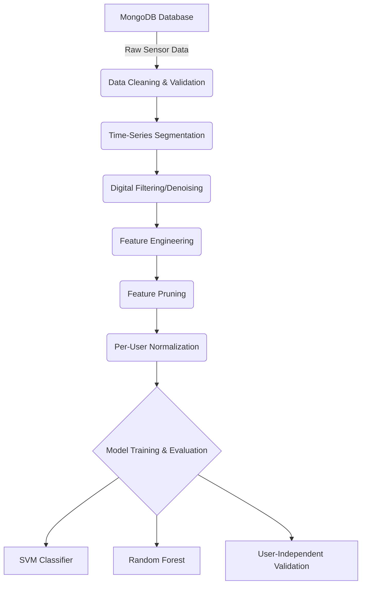

# Gesture Recognition Pipeline Architecture

This document describes the end-to-end data processing and machine learning pipeline for the Human Gesture Recognition project, as implemented in `aiot_project_feature_engineering.ipynb`.

## Pipeline Overview

The pipeline transforms raw accelerometer and gyroscope data from IoT devices into a robust, user-independent gesture classification model.

---

## 1. Data Ingestion & Cleaning
*   **Source**: Raw sensor data (Acc/Gyr) is pulled from MongoDB collections.
*   **Missing Values**: Handled using **Linear Interpolation** followed by backward/forward fill to ensure continuous signals.
*   **Outlier Management**: 
    *   **Capping**: Gyroscope values are capped at the 1st and 99th percentiles.
    *   **Leakage Prevention**: Percentiles are calculated *only* from training users (01, 03) and applied to the entire dataset.

## 2. Signal Segmentation
*   **Sliding Window**: Continuous streams are broken into fixed-length windows.
*   **Parameters**:
    *   **Window Size**: 256 samples (approx. 2.5s at 100Hz).
    *   **Overlap**: 50% (128 samples).
    *   **Windowing Function**: **Hann Window** applied to minimize spectral leakage at window edges.
*   **Grouping**: Segmentation is performed per-user and per-gesture to prevent cross-contamination.

## 3. Denoising (Butterworth Filter)
To remove high-frequency jitter and sensor noise, a digital low-pass filter is applied to every window:
*   **Type**: 4th-order Butterworth Low-pass.
*   **Cutoff**: 0.2 (normalized frequency).
*   **Benefit**: Smooths the signal while preserving the fundamental motion components.

## 4. Feature Engineering
We extract a multidimensional feature vector (68 initial features) from each window:
*   **Statistical Core**: Mean, STD, RMS, Zero-Crossing Rate, Peak-to-Peak.
*   **Multi-Axis Dynamics**: Magnitude (Acc & Gyr), Inter-axis Correlation (XY, XZ, YZ).
*   **Orientation**: Pitch and Roll calculated from accelerometer gravity components.
*   **Frequency Domain**: Dominant Frequency, Spectral Entropy, and Spectral Energy (via FFT).

## 5. Pruning & Normalization
*   **Manual Pruning**: Dropped 20 noisy features (**Skewness, Kurtosis, SMA, Spectral Energy**) to improve model stability and focus on universal patterns.
*   **Per-User Scaling**: 
    *   Unlike global scaling, we apply `StandardScaler` **individually for each user**.
    *   **Why?** This removes "personal style" offsets (e.g., one user moving faster than another) while preserving the relative motion patterns that define the gesture.

## 6. Model Training & Validation
*   **User-Independent Split**: 
    *   **Train**: Users 01 and 03.
    *   **Test**: User 02 (Strictly unseen during training).
*   **Classifiers**: 
    *   **SVM (RBF Kernel)**: Captures complex non-linear boundaries.
    *   **Random Forest**: Provides high interpretability and captures threshold-based logic.

---

The following table provides placeholders for performance metrics. You should update these with the actual results from the final cells of `aiot_project_feature_engineering.ipynb` after execution.

| Model | Accuracy | F1-Score |
| :--- | :--- | :--- |
| **SVM (RBF)** | TBD | TBD |
| **Random Forest**| TBD | TBD |

> [!TIP]
> For production deployment, ensure the `StandardScaler` parameters are cached per user if possible, or use the global mean of per-user means for completely new users.

---

## 🚀 Troubleshooting & Roadmap (Current Status: ~25% Accuracy)

We are currently investigating the low accuracy observed during user-independent testing. The following improvements are being integrated into the pipeline:

1.  **Smart Windowing (Activity Detection)**: 
    *   Switching from fixed sliding windows to **Peak-Centered Windowing**. 
    *   This ensures windows are triggered by movement magnitude, removing "idle" noise from the dataset.
2.  **Orientation Invariance**: 
    *   Evaluating a **Magnitude-Only model** to bypass issues caused by different phone orientations (Portrait vs. Landscape) between users.
3.  **Data Augmentation**: 
    *   Implementing **Synthetic Rotations** for training data to simulate different device orientations, improving the model's ability to generalize to new users.
4.  **Feature Pruning**: 
    *   Further refinement of the 48-feature set to remove any remaining features that exhibit high inter-user variance but low intra-gesture variance.
