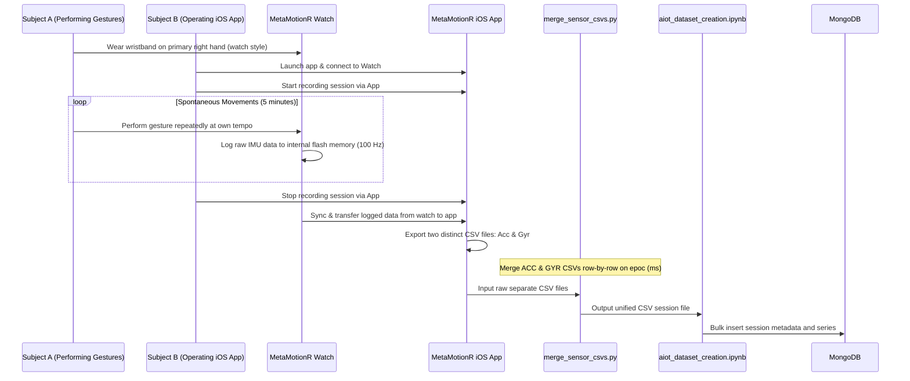
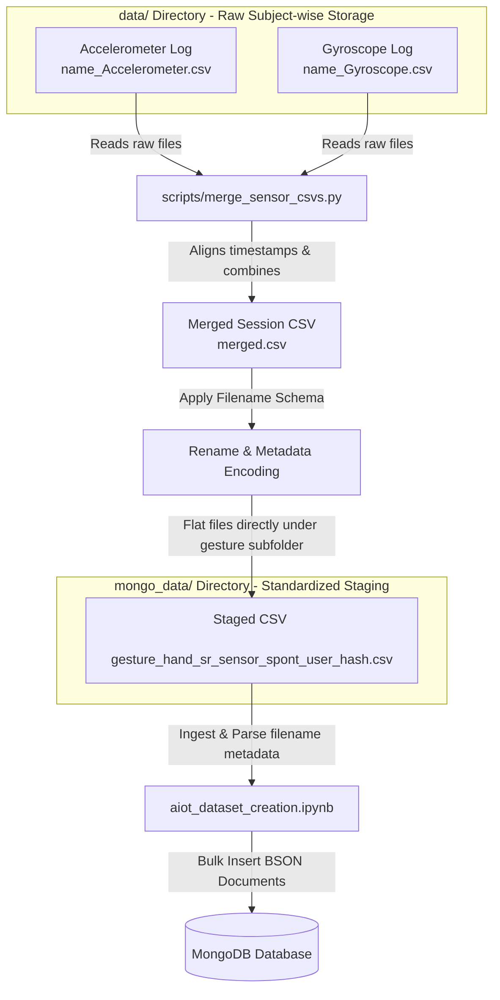

# Gesture Collection Procedure

This document details the hardware configuration, data collection protocol, and experimental biases for the **AIoT Human Gesture Recognition** dataset.

---

## 1. Hardware & Sensor Configurations

The dataset was collected using the following sensor hardware and setup:
*   **Sensor Kit**: **MetaMotionR** research sensor kit and its wristband, which is a wrist-worn device that provides recorded (logging) or real-time (streaming) sensor data.
*   **Wearable Setup**: The wristband was worn exactly like wearing a normal watch on the **primary (right) hand** of the participant.
*   **Sensor Type**: 6-channel Inertial Measurement Unit (IMU) consisting of:
    *   3-axis Accelerometer
    *   3-axis Gyroscope
*   **Sampling Rate**: $100\text{ Hz}$ across all 6 channels.
*   **Sensor Dynamic Range**:
    *   Accelerometer configuration: $\pm 16\text{ g}$
    *   Gyroscope configuration: $\pm 2000^\circ/\text{s}$
*   **Data Interface & Transfer Flow**: 
    1. During the recording session, the watch logs the raw 6-channel IMU data directly to its internal memory.
    2. Once the 5-minute session is finished, the logged data is synced and transferred from the watch to the MetaMotion iOS application.
    3. The iOS app exports the session as **two distinct CSV files**: one containing the accelerometer data (`*_Accelerometer.csv`) and one containing the gyroscope data (`*_Gyroscope.csv`).

---

## 2. Gesture Categories & Protocols

### Gesture Definitions
*   **Swipe Gestures (Thumb)**: `swipe-up-thumb`, `swipe-down-thumb`, `swipe-left-thumb`, `swipe-right-thumb`
    *   Performed using the thumb finger of the primary (right) hand wearing the wristband.
*   **Texting Gesture**: `texting`
    *   Performed using both hands (two-handed interaction style).

### Logging & Session Protocol
*   **One Gesture per Session**: In accordance with the project guidelines, each independent recording session was dedicated to exactly one gesture.
*   **Continuous Streaming/Logging**: The motion was repeated spontaneously and continuously throughout the session.
*   **Duration**: Each session lasted for a single uninterrupted **5-minute session** (yielding approximately 30,000 samples per channel per session).
*   **No Stop/Pause**: The recording was not stopped or paused at any point during the 5 minutes. The downstream preprocessing pipeline handles the segmentation of these continuous streams into fixed-size windows using a sliding window algorithm (defined in `config.yml`).

---

## 3. Sensor Data Merging Pipeline

Because the raw accelerometer and gyroscope data are exported as two separate CSV files, they must be combined before database insertion:
*   **Alignment Key**: The alignment is performed based on the epoch millisecond timestamp (`epoc (ms)`).
*   **Merging Script**: The Python script [merge_sensor_csvs.py](file:///home/spman/ceid/Iot_TimeSeries/scripts/merge_sensor_csvs.py) scans the target folders, pairs up the accelerometer and gyroscope files sharing the same prefix, and merges them row-by-row into a single CSV file.
*   **Output Columns**: The resulting merged CSV contains the columns `["epoc (ms)", "timestamp (+0300)", "elapsed (s)", "x-axis (g)", "y-axis (g)", "z-axis (g)", "x-axis (deg/s)", "y-axis (deg/s)", "z-axis (deg/s)"]`.

---

## 4. Participant Demographics & Individual Styles

*   **Participants**: Data was collected from **3 subjects** (labeled User `01`, `02`, and `03` in the dataset).
*   **Realistic Context**: Each user performed the gesture user-specifically (in their own natural tempo) while interacting with applications of their own choosing (e.g. browsing social media, texting, or scrolling through feeds). No external pacing or metronome was used.

---

## 5. Critical Biases & Machine Learning Generalization

A key highlight of this dataset is the presence of physical and contextual biases that directly impact machine learning generalization across users:

### The User 03 Orientation Bias
*   **The Issue**: During the collection of the `swipe-right-thumb` and `swipe-left-thumb` gestures, **User 03 held the device horizontally** instead of vertically (which was the default posture for Users 01 and 02).
*   **The Impact (Gravity Bias)**: Since gravity ($1\text{ g}$) constantly acts on the accelerometer, changing the wrist/device orientation shifts the gravity component to a different sensor axis.
*   **Machine Learning Takeaway**: When training models (classical SVM/Random Forest or 1D CNNs) on Users 01 & 02 and testing on User 03 (Subject-Wise Split), accuracy drops sharply. This is not a failure of the algorithms, but a direct result of this physical domain shift (gravity bias).

---

## 6. Collection Flow

The following diagram illustrates the experimental data collection sequence:

### Data Ingestion & Transformation Flowchart

The diagram below details the files' physical locations, naming formats, and processing stages from raw device storage to MongoDB loading:

---

## 7. Directory Structure & File Roles

To help reviewers understand the role of each file and folder in the collection and ingestion pipeline, here is a detailed breakdown of their layout:

### A. Raw Data Storage (`data/` Directory)
This is the workspace containing raw logging files exported from the wearable device. Files are nested inside gesture and user-specific subfolders (e.g., `data/swipe-down-thumb/andreas/`):
* **`*.zip` (e.g., `andreasswipedown.zip`):** The raw compressed archive containing the original data directories as exported from the MetaMotion iOS App over Bluetooth.
* **`*_Accelerometer.csv`:** The raw, unaligned accelerometer data log containing time-series columns for linear acceleration (`x-axis (g)`, `y-axis (g)`, `z-axis (g)`).
* **`*_Gyroscope.csv`:** The raw, unaligned gyroscope data log containing time-series columns for angular velocity (`x-axis (deg/s)`, `y-axis (deg/s)`, `z-axis (deg/s)`).
* **`merged.csv`:** The intermediate output generated by the merging script. It holds the combined 6-channel sensor logs, perfectly aligned row-by-row by matching epoch milliseconds (`epoc (ms)`).
* **`[metadata_schema_name].csv` (e.g., `swipe-down-thumb_0_100_AccGyr_1_0_01_ffd8b66499c6566cbc90e21c.csv`):** The final merged CSV file, renamed according to the standardized metadata schema, indicating it is verified and ready for database staging.

### B. Database Staging Area (`mongo_data/` Directory)
This directory acts as the ingestion staging area. It contains only the final renamed, merged CSV files, grouped flatly under their respective gesture folders (e.g., `mongo_data/swipe-down-thumb/`):
* **`*.csv`:** The flat list of renamed, merged files (e.g., one file per user per session). Leaving them flat directly under the gesture name ensures the database import notebook can read them sequentially without nested directory conflicts.

### C. Pipeline Scripts & Notebooks
* **`scripts/merge_sensor_csvs.py`:** The python script used to automate raw file processing. It walks through all subfolders in the `data/` directory, pairs up accelerometer and gyroscope logs, aligns their timestamps, and outputs the combined CSV.
* **`aiot_dataset_creation.ipynb`:** The database import notebook. It scans the `mongo_data/` folders, parses the filenames to extract metadata, maps column headers, and uploads the sessions as unified documents into MongoDB.
