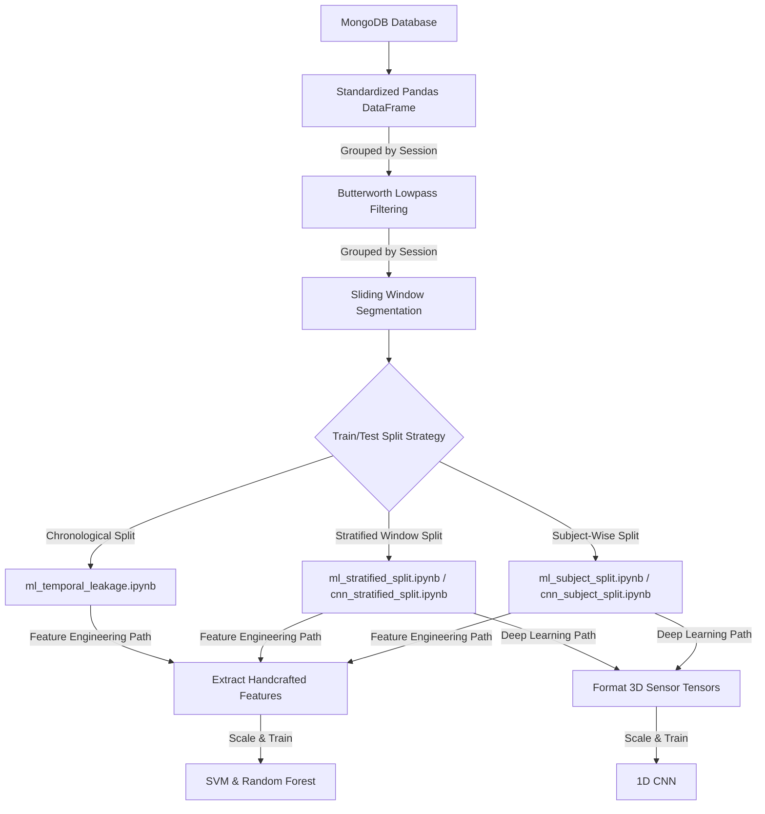

# Gesture Recognition Pipeline Documentation

This document describes the complete time-series processing and model classification pipeline for the **AIoT Human Gesture Recognition** project. 

---

## Pipeline Flowchart

Below is a visual overview of how raw accelerometer and gyroscope signals from MongoDB are transformed, split, and fed into the classical machine learning and deep learning branches.



> [!NOTE]
> **Key Pipeline Rules:**
> 1. **Per-Session Preprocessing**: Filtering and window segmentation are performed strictly within isolated sessions (grouped by `["gesture_id", "user"]`) to prevent boundary distortions and dataset mixing.
> 2. **Train-Only Feature Selection & Scaling**: To avoid data leakage, EDA feature selection (ANOVA, correlation filtering, and boxplot checks) and scaling fitting are done **strictly on the training set**. The test set is only transformed using the resulting configuration/parameters.

---

## 1. Data Ingestion & Formatting

The pipeline begins by fetching documents from the MongoDB collection. Each document contains time-series lists representing:
- Accelerometer axes: `acc_x`, `acc_y`, `acc_z`
- Gyroscope axes: `gyr_x`, `gyr_y`, `gyr_z`
- Metadata: `user`, `gesture_id`, `hand`, `sr`, `sensor`, etc.

The lists are flattened and combined into a standardized Pandas DataFrame with columns: `["acc_x", "acc_y", "acc_z", "gyr_x", "gyr_y", "gyr_z", "gesture_id", "user"]`.

---

## 2. Signal Preprocessing

Preprocessing is defined in [utils.py](file:///home/spman/ceid/Iot_TimeSeries/utils.py) and is executed strictly on a **per-session (recording) basis** to avoid signal distortion at trial boundaries and prevent data leakage. For the detailed technical rationale, see [Feature Engineering & Exploratory Data Analysis](readme_features.md).

### A. Butterworth Filter
To remove high-frequency noise from body tremor and sensor imperfections, a low-pass Butterworth filter is applied using `scipy.signal.sosfiltfilt` (zero-phase filtering to prevent phase shift):
*   **Default configuration**: 3rd-order filter, critical frequency $W_n = 0.17$ (normalized by Nyquist frequency).

### B. Sliding Window Segmentation
The filtered signals are sliced into overlapping windows using `pandas.DataFrame.rolling`. 
*   **Window Size ($ws$)**: `150` samples (1.5 seconds at 100Hz).
*   **Overlap**: `75` samples (50% overlap).
*   **Windowing Function**: `"hann"` window applied to taper the edges of each segment.

---

## 3. Modeling Branch A: Feature Engineering

Before training, a detailed 8-step Exploratory Data Analysis (EDA) and feature selection pipeline is executed. For a full breakdown of these steps, see the [Feature Engineering & Exploratory Data Analysis Documentation](readme_features.md).

In the notebooks [ml_subject_split.ipynb](file:///home/spman/ceid/Iot_TimeSeries/ml_subject_split.ipynb) and [ml_stratified_split.ipynb](file:///home/spman/ceid/Iot_TimeSeries/ml_stratified_split.ipynb), we extract statistical descriptors using [utils_features.py](file:///home/spman/ceid/Iot_TimeSeries/utils_features.py):

For each 150-sample window, `extract_all_candidates()` computes **134 descriptors**:
*   **Time-Domain features** (per-channel): Mean, Standard Deviation, Root Mean Square (RMS), Skewness, Kurtosis, Zero-Crossing Rate, Interquartile Range (IQR).
*   **Frequency-Domain features** (per-channel): Dominant frequency, Spectral Entropy, Mean Frequency, and Band-Energy Ratios.
*   **Cross-Channel information**: Signal Magnitude Area (SMA), pairwise axis correlations (e.g. correlation between `acc_x` and `acc_y`).

### Models Trained
- **Support Vector Machine (SVM)** with RBF Kernel
- **Random Forest Classifier**

---

## 4. Modeling Branch B: Deep Learning (1D CNN)

In the notebooks [cnn_subject_split.ipynb](file:///home/spman/ceid/Iot_TimeSeries/cnn_subject_split.ipynb) and [cnn_stratified_split.ipynb](file:///home/spman/ceid/Iot_TimeSeries/cnn_stratified_split.ipynb), the 3D window tensors are fed directly to a lightweight neural network.

### Input Tensor Shape
$$(N_{\text{windows}}, \text{window size}, N_{\text{channels}}) = (N, 150, 6)$$

### 1D CNN Architecture
```text
┌──────────────────────────────────────────────────────────┐
│             Input Window Tensor: (150, 6)                │
└───────────────────────────┬──────────────────────────────┘
                            ▼
┌──────────────────────────────────────────────────────────┐
│  Conv1D Layer (64 filters, kernel size 5, same padding)  │
└───────────────────────────┬──────────────────────────────┘
                            ▼
┌──────────────────────────────────────────────────────────┐
│      Batch Normalization + ReLU Activation               │
└───────────────────────────┬──────────────────────────────┘
                            ▼
┌──────────────────────────────────────────────────────────┐
│              Global Average Pooling 1D                   │
└───────────────────────────┬──────────────────────────────┘
                            ▼
┌──────────────────────────────────────────────────────────┐
│        Dense Hidden Layer (64 units, ReLU)               │
└───────────────────────────┬──────────────────────────────┘
                            ▼
┌──────────────────────────────────────────────────────────┐
│                  Dropout Layer (30%)                     │
└───────────────────────────┬──────────────────────────────┘
                            ▼
┌──────────────────────────────────────────────────────────┐
│           Dense Output Layer (Softmax, C classes)        │
└──────────────────────────────────────────────────────────┘
```

---

## 5. Validation Split Strategies

Both branches are tested using two methods to contrast **user-dependent** performance vs. **generalization capacity**:

### I. Stratified Random Split (Windows Mixed)
*   **Process**: All window samples across all users are pooled together. A random 80/20 train/test split is applied.
*   **Stratification**: Balanced on a joint key of `[gesture_id]_[user]` to ensure equal representation.
*   **Caveat**: Since different windows from the *same* user recording appear in both training and test sets, the model learns the specific movement style of the subjects, leading to high (but overly optimistic) accuracy.

### II. Subject-Wise Split (User Split)
*   **Process**: The split is strictly partition-based on the `user` field.
*   **Setup**: Trained on data from subjects `01` and `02`, and evaluated on subject `03`.
*   **Goal**: Simulates a plug-and-play system testing how the model responds to a completely unseen user. This provides a more realistic measure of generalization.

### III. Chronological Split (No Temporal Leakage)
*   **Process**: Continuous sessions are split chronologically (e.g. first 75% of the timeline for training, last 25% for testing) **before** running the sliding-window segmentation algorithm.
*   **Setup**: Evaluated on all users (`01`, `02`, `03`) to isolate the effect of temporal leakage without user differences.
*   **Goal**: Removes the 50% window overlap (temporal leakage) that inflates scores in random stratified splits, yielding the true performance baseline (~62%–67%) on known users.
